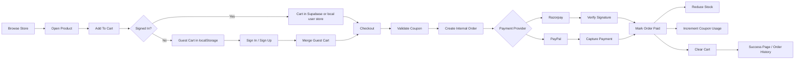
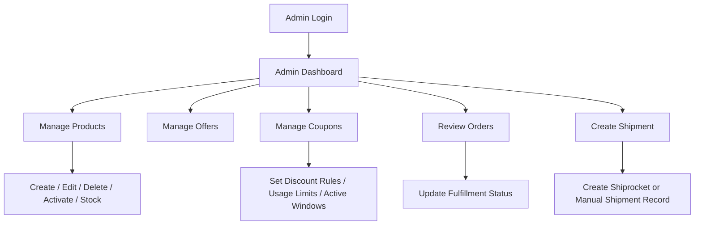
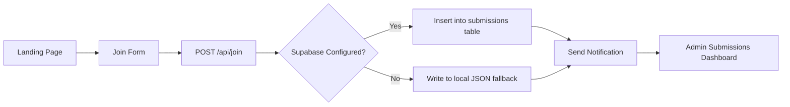

# Dhyan Yog Kendra Ecommerce Platform

Production-oriented wellness platform and ecommerce system built with Next.js, Supabase, and Vercel for Dhyan Yog Kendra Evam Prakratik Chikitsa Shodh Sansthan.

This codebase now supports:

- customer authentication with Supabase Auth
- dynamic storefront and product detail pages
- guest cart and signed-in cart persistence
- coupon-aware checkout
- Razorpay and PayPal payment orchestration
- account dashboard with addresses and order history
- admin commerce dashboard for products, offers, coupons, orders, and shipment creation
- inquiry/join form with Supabase or local JSON fallback

## Stack

- Next.js 15 App Router
- React 19
- TypeScript
- Supabase Auth, Database, Storage
- Vercel deployment target
- Razorpay
- PayPal
- Shiprocket-ready shipment hooks
- Resend / SMTP notifications

## Core Modules

```text
app/
  admin/                          Admin UI
  api/                            Route handlers for auth/account/checkout/payments/admin
  auth/                           Sign in, sign up, OAuth callback
  cart/                           Cart page
  checkout/                       Checkout flow and success page
  store/                          Product listing and product detail
  account/                        Customer profile, addresses, orders
  components/                     Shared UI and cart provider

lib/
  commerce.ts                     Commerce data layer and state transitions
  commerce-pricing.ts             Coupon validation and shipping calculations
  commerce-integrations.ts        Razorpay / PayPal / Shiprocket integration helpers
  auth-user.ts                    Authenticated user lookup
  supabase/                       Browser, server, middleware clients

supabase/
  commerce.sql                    Commerce schema + RLS policies
  submissions.sql                 Lead form schema

data/
  commerce.json                   Local fallback catalog and commerce seed data
  commerce-users.json             Local fallback user/cart/profile data
  join-submissions.json           Local fallback lead submissions
```

## User Flows

### Customer Purchase Flow



### Admin Commerce Flow



### Lead Capture Flow



## Feature Status

### Customer

- sign up with email/password
- sign in with email/password
- Google OAuth callback flow
- dynamic storefront
- product detail with gallery and reviews
- guest cart
- signed-in cart
- guest cart merge after sign-in
- coupon validation at checkout
- Razorpay checkout initiation and verification
- PayPal order creation and capture
- order success flow
- saved profile and addresses
- order history

### Admin

- password-protected admin session
- product CRUD
- product image upload to Supabase Storage
- offer CRUD
- coupon CRUD
- fulfillment status updates
- shipment record creation
- customer summary view

## Architecture Notes

### Cart

- Guests use `localStorage`
- Signed-in users use `/api/cart`
- On sign-in, guest cart items are merged into the authenticated cart

### Orders

- Checkout creates an internal order first
- Stock is reduced only after payment capture, not at order creation
- Coupon usage count increments only after successful payment
- Fulfillment and payment statuses are tracked independently

### Coupons

Coupons support:

- percent discounts
- flat discounts
- minimum order amount
- active / inactive state
- usage limit
- usage count
- start and end timestamps

### Fallback Mode

If Supabase service credentials are missing, the app still runs with local JSON files for:

- catalog snapshot
- profiles / addresses / cart data
- join submissions

This is useful for local demos, but production should use Supabase.

## Environment Variables

Copy [.env.example](./.env.example) to `.env.local`.

### Required for full production flow

```env
SUPABASE_URL=
SUPABASE_SERVICE_ROLE_KEY=
NEXT_PUBLIC_SUPABASE_URL=
NEXT_PUBLIC_SUPABASE_ANON_KEY=
ADMIN_ACCESS_KEY=
```

### Payments and logistics

```env
RAZORPAY_KEY_ID=
RAZORPAY_KEY_SECRET=
PAYPAL_CLIENT_ID=
PAYPAL_CLIENT_SECRET=
PAYPAL_ENVIRONMENT=sandbox
SHIPROCKET_EMAIL=
SHIPROCKET_PASSWORD=
```

### Notifications

```env
SMTP_HOST=
SMTP_PORT=
SMTP_SECURE=
SMTP_USER=
SMTP_PASS=
RESEND_API_KEY=
NOTIFICATION_EMAIL_TO=
NOTIFICATION_EMAIL_FROM=
```

## Supabase Setup

Run these SQL files in Supabase SQL Editor:

1. `supabase/submissions.sql`
2. `supabase/commerce.sql`

`supabase/commerce.sql` now includes:

- commerce tables
- cart tables
- order and shipment tables
- RLS enablement
- customer-facing policies for authenticated access

### Storage

Create a public storage bucket named `products` for admin image uploads.

## Local Development

```powershell
npm install
npm run dev
```

Open `http://localhost:3000`

## Quality Checks

```powershell
npm run lint
npm run build
```

Both commands pass on the current codebase.

## Key Routes

### Public

- `/`
- `/store`
- `/store/[slug]`
- `/cart`
- `/checkout`
- `/join`
- `/auth/sign-in`
- `/auth/sign-up`

### Customer

- `/account`
- `/account/orders`
- `/account/orders/[orderId]`

### Admin

- `/admin`
- `/admin/submissions`

## API Surface

### Customer / Checkout

- `GET|POST|PATCH|DELETE /api/cart`
- `POST /api/checkout`
- `POST /api/coupons/validate`
- `POST /api/payments/razorpay/verify`
- `POST /api/payments/paypal/capture`
- `POST /api/payments/mock/confirm`
- `GET|PUT /api/account/profile`
- `GET|POST|DELETE /api/account/addresses`
- `POST /api/store/reviews`

### Admin

- `POST /api/admin/login`
- `POST /api/admin/logout`
- `POST /api/admin/commerce/products/upsert`
- `POST /api/admin/commerce/products/delete`
- `POST /api/admin/commerce/products/upload`
- `POST /api/admin/commerce/offers/upsert`
- `POST /api/admin/commerce/offers/delete`
- `POST /api/admin/commerce/coupons/upsert`
- `POST /api/admin/commerce/coupons/delete`
- `POST /api/admin/commerce/orders/fulfillment`
- `POST /api/admin/commerce/shipments/create`

## Deployment

Recommended deployment:

- frontend on Vercel
- database/auth/storage on Supabase
- payments through Razorpay and PayPal
- shipment creation through Shiprocket

### Production Checklist

- set all required env vars in Vercel
- run `supabase/commerce.sql`
- run `supabase/submissions.sql`
- configure Google OAuth callback URLs
- create Supabase `products` storage bucket
- verify Razorpay production keys
- verify PayPal production credentials if international payments are needed
- verify Shiprocket credentials
- test one real checkout in production

## Business Rules Implemented

- checkout requires authenticated customer
- guest cart persists locally until sign-in
- cart merges after login
- invalid or expired coupons are rejected
- stock cannot go below zero during order creation
- stock only decreases after payment confirmation
- coupon usage count increases only once after successful payment
- order fulfillment changes update business status progression

## Notes

- `SUPABASE_SERVICE_ROLE_KEY` must never be exposed to the client
- `NEXT_PUBLIC_*` keys are the only Supabase keys used in browser auth
- without payment keys, the app falls back to mock confirmation for safe local testing
- there is an untracked `supabase/full_schema.sql` in the repo workspace; it is not required by this README or deployment flow
